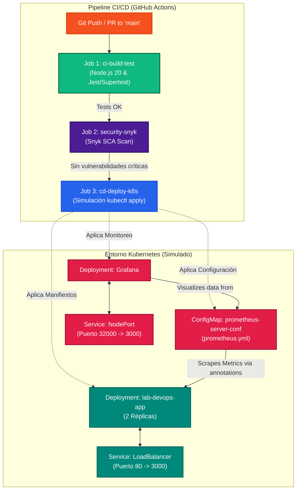

# Laboratorio Técnico DevSecOps: mi-proyecto-devops-u3

Este proyecto es un laboratorio técnico práctico enfocado en la implementación de un ciclo de vida DevSecOps completo (CI/CD, Seguridad y Monitoreo). Todo el ciclo está orquestado al 100% mediante **GitHub Actions** y está configurado para desplegarse en un entorno de **Kubernetes**.

---

## Arquitectura del Ciclo DevSecOps

El siguiente diagrama detalla el flujo completo desde que un desarrollador realiza un cambio en el código fuente hasta la simulación del despliegue y la orquestación del monitoreo en Kubernetes:



---

## Stack Tecnológico

*   **API Backend:** Node.js con Express.
*   **Framework de Pruebas:** Jest y Supertest.
*   **Contenerización:** Docker (Imagen optimizada `node:20-alpine`).
*   **Seguridad SCA (Software Composition Analysis):** Snyk.
*   **Orquestación e Infraestructura:** Kubernetes (Manifiestos YAML).
*   **Monitoreo y Observabilidad:** Prometheus (ConfigMap de scraping) y Grafana.
*   **Automatización de Pipeline:** GitHub Actions.

---

## Estructura del Proyecto

```text
mi-proyecto-devops-u3/
├── .github/
│   └── workflows/
│       └── cicd.yml           # Pipeline de integración y despliegue continuo
├── k8s/
│   ├── app-deployment.yaml    # Manifiesto de la aplicación principal y su Service
│   ├── grafana-deploy.yaml    # Manifiesto de despliegue de Grafana y Service NodePort
│   └── prometheus-config.yaml # Configuración de Prometheus para scraping de pods
├── src/
│   ├── index.js               # Código de la API REST básica con Express
│   └── index.test.js          # Pruebas unitarias de Jest y Supertest
├── .dockerignore              # Archivos excluidos del build de Docker
├── .gitignore                 # Archivos excluidos del repositorio Git
├── Dockerfile                 # Dockerfile de producción con multi-stage build
├── package.json               # Dependencias y scripts del proyecto Node.js
├── package-lock.json          # Bloqueo de versiones para instalaciones consistentes
└── README.md                  # Detalles del proyecto y guía de uso
```

---

## Pasos para su Ejecución y Pruebas

### 1. Requisitos Previos

Asegúrate de contar con lo siguiente instalado en tu entorno de desarrollo local:
*   [Node.js](https://nodejs.org/) v20 o superior.
*   [Git](https://git-scm.com/).
*   [Docker](https://www.docker.com/) (Opcional, para empaquetado de contenedores).

---

### 2. Configuración y Pruebas Locales

1.  **Instalar dependencias:**
    ```bash
    npm install
    ```
2.  **Ejecutar pruebas de integración:**
    ```bash
    npm test
    ```
3.  **Iniciar la aplicación en modo desarrollo:**
    ```bash
    npm start
    ```
    La aplicación estará escuchando en el puerto `3000`. Puedes validar su funcionamiento abriendo en tu navegador: `http://localhost:3000/`. Deberías recibir una respuesta JSON como esta:
    ```json
    {
      "status": "ok",
      "message": "DevSecOps Lab API is running successfully",
      "timestamp": "2026-06-12T01:24:28.000Z",
      "environment": "development"
    }
    ```

---

### 3. Construcción del Contenedor Docker

La imagen de Docker utiliza un enfoque de **construcción multi-etapa** para reducir el tamaño final de la imagen y corre bajo un usuario no privilegiado (`node`) para minimizar la superficie de ataque:

```bash
# Construir la imagen localmente
docker build -t jhondiazg/lab-devops-app:latest .

# Ejecutar el contenedor
docker run -p 3000:3000 jhondiazg/lab-devops-app:latest
```

---

### 4. Configuración del Pipeline de GitHub Actions

El archivo del workflow está definido en [.github/workflows/cicd.yml](file:///.github/workflows/cicd.yml). Para que el job `security-snyk` funcione correctamente sin fallas, debes proveer el token de Snyk:

1.  Regístrate de forma gratuita en [Snyk](https://snyk.io/) y obtén tu token de API (`SNYK_TOKEN`).
2.  Ve a tu repositorio de GitHub.
3.  Dirígete a **Settings** > **Secrets and variables** > **Actions**.
4.  Crea un nuevo secreto de repositorio haciendo clic en **New repository secret**.
5.  Nómbralo `SNYK_TOKEN` y pega tu token de Snyk.

El pipeline ejecutará automáticamente 3 etapas en secuencia cada vez que hagas un push o un Pull Request a `main`:
1.  **ci-build-test**: Levanta Node.js 20, instala dependencias usando `npm ci` y corre la suite de pruebas unitarias.
2.  **security-snyk**: Realiza un escaneo de dependencias (SCA) en busca de vulnerabilidades de severidad alta.
3.  **cd-deploy-k8s**: Simula la aplicación (`kubectl apply`) de todos los manifiestos configurados en la carpeta `k8s/` y despliega la aplicación de manera simulada.

---

### 5. Configuración y Despliegue en Kubernetes (k8s/)

Si tienes un clúster local de Kubernetes (Minikube o Docker Desktop), puedes aplicar los manifiestos creados usando los siguientes comandos:

1.  **Aplicar configuración de Prometheus:**
    ```bash
    kubectl apply -f k8s/prometheus-config.yaml
    ```
2.  **Desplegar la aplicación principal:**
    ```bash
    kubectl apply -f k8s/app-deployment.yaml
    ```
3.  **Desplegar Grafana para monitoreo:**
    ```bash
    kubectl apply -f k8s/grafana-deploy.yaml
    ```
4.  **Verificar el estado del despliegue:**
    ```bash
    kubectl get all
    ```
